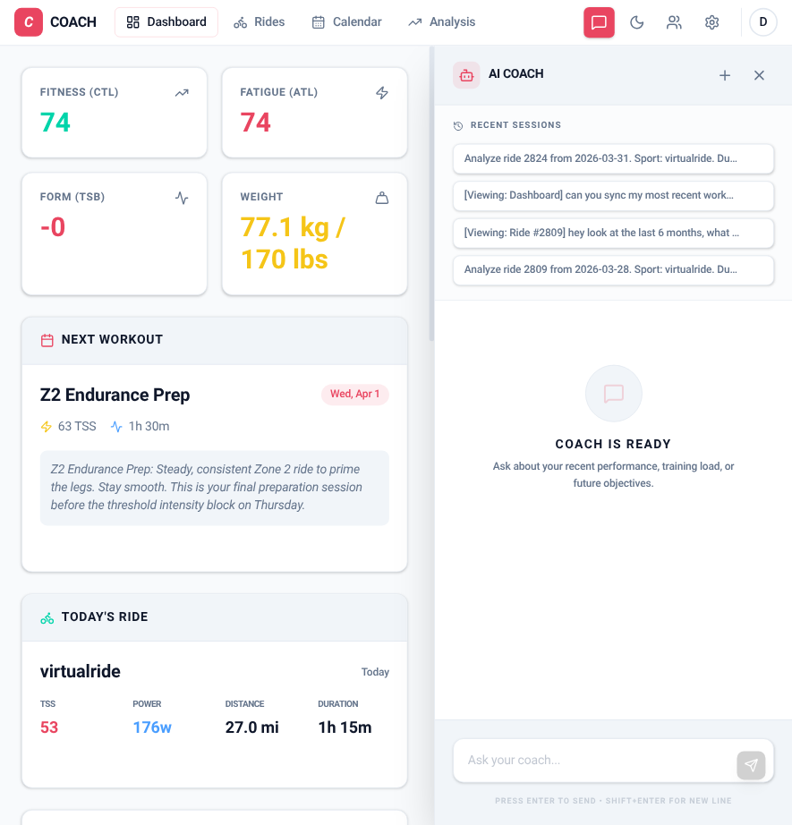
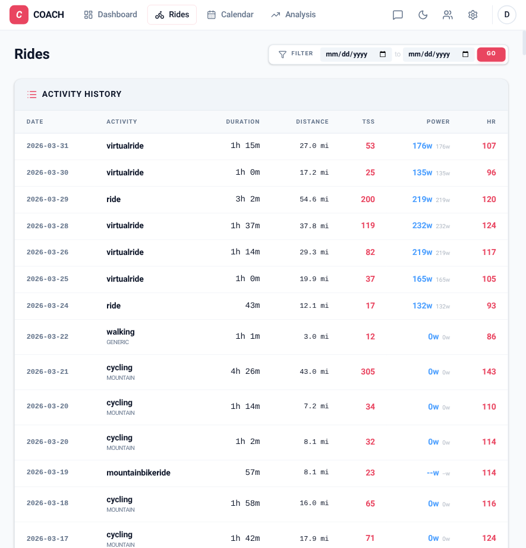
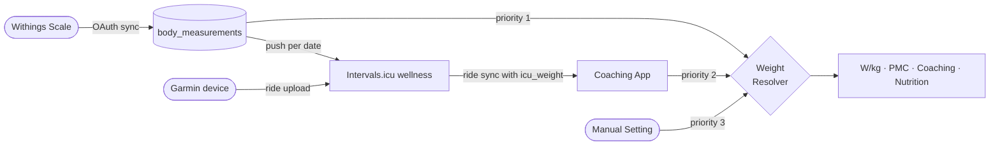
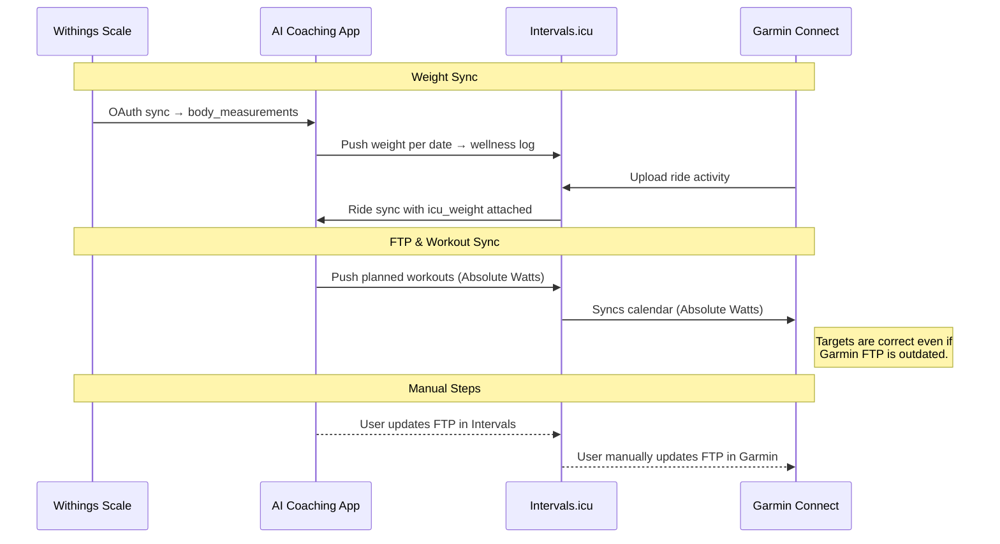

# Cycling Coaching Platform

A powerful, AI-integrated coaching platform for cyclists. This application ingests ride data, computes advanced training metrics (PMC), and provides personalized coaching insights using Gemini.





## Features

- **Performance Management Chart (PMC)**: Track your Fitness (CTL), Fatigue (ATL), and Form (TSB) over time.
- **Ride Analysis**: Detailed breakdown of every ride, including power, heart rate, and interval data.
- **AI Coaching**: An integrated AI coach that analyzes your training history to provide insights, recommendations, and structured workouts.
- **Structured Workouts**: Generate and sync workouts directly to Intervals.icu and Garmin.
- **Automated Sync**: Seamlessly pull data from Intervals.icu.

## How it Works

The platform acts as an intelligent layer on top of your existing cycling data ecosystem. It pulls raw activity data and wellness metrics, processes them to calculate training stress, and uses an LLM-based agent to provide a conversational coaching experience.

### Technical Stack
- **Backend**: FastAPI (Python)
- **Frontend**: React + TypeScript + Tailwind CSS
- **Database**: PostgreSQL
- **AI**: Gemini (via Vertex AI)
  - Google Agent Development Kit (ADK)
- **Integrations**: Intervals.icu API

## Systems of Record

To ensure data consistency across your devices and platforms, the following data flow is recommended:

### Weight (Wellness)
**Withings** (or manual entry in Settings) is the primary source of weight. The app follows a priority chain to resolve weight for any given date:

```
Priority 1 (highest): Withings scale measurement for that date
Priority 2:           Most recent Intervals.icu ride weight on or before that date
Priority 3:           Manual weight entry in Settings
Priority 4 (default): 75 kg fallback
```

When Withings is synced, weight measurements are written to the local database **and** pushed to Intervals.icu's wellness log per date. This ensures that subsequent ride syncs from Intervals.icu carry the correct scale weight.

> **Overriding Withings weight:** When Withings is connected, the weight field in Settings is read-only. To enter a manual weight (e.g. a race-day override), disconnect Withings via Settings → Withings → Disconnect, update the weight field, then reconnect. Reconnecting just re-runs the OAuth flow — your Withings account remains linked and no data is lost.



> **Note:** Garmin Connect does not have a Withings integration and provides no API for writing weight. The Garmin FIT file weight field is a device snapshot and is not used as an authoritative source.

### FTP (Functional Threshold Power)
**Intervals.icu** is the primary system of record for FTP and training zones.
1. When the AI Coach recommends an FTP update or you perform a test, update it in **Intervals.icu**.
2. The **Coaching Platform** uses this FTP to calculate Intensity Factor (IF) and TSS for future workouts.
3. **Manual Sync**: You must manually update your FTP in **Garmin Connect** settings to ensure your bike computer's on-screen zones and recovery metrics are accurate.

### Data Flow Diagram



## Getting Started

### Prerequisites
- Python 3.11+
- Node.js & npm
- PostgreSQL (or Podman/Docker)
- Intervals.icu API Key & Athlete ID

### GCP Permissions

The Cloud Run service account requires the following IAM bindings. Replace `<SERVICE_ACCOUNT>` with the runtime SA (e.g. the Compute Engine default SA or a dedicated SA attached to the Cloud Run service).

```bash
# Meal photo uploads (Cloud Storage) — required by server/nutrition/photo.py
gcloud storage buckets add-iam-policy-binding gs://jasondel-coach-data \
    --member="serviceAccount:<SERVICE_ACCOUNT>" \
    --role="roles/storage.objectCreator"

# Cloud Trace telemetry — required by server/telemetry.py (OpenTelemetry exporter)
gcloud projects add-iam-policy-binding jasondel-cloudrun10 \
    --member="serviceAccount:<SERVICE_ACCOUNT>" \
    --role="roles/cloudtrace.agent"
```

### Installation

1. **Clone the repository**:
   ```bash
   git clone https://github.com/jasondel/coach.git
   cd coach
   ```

2. **Backend Setup**:
   ```bash
   python -m venv venv
   source venv/bin/activate
   pip install -r requirements.txt
   cp .env.example .env  # Update with your credentials
   ```

3. **Frontend Setup**:
   ```bash
   cd frontend
   npm install
   npm run build
   ```

4. **Run the App**:
   ```bash
   # From the root
   ./scripts/dev.sh
   ```

## Development

- **Backend**: `uvicorn server.main:app --reload`
- **Frontend**: `cd frontend && npm run dev`
- **Testing**: `pytest`

## Releases

Releases are managed via the `/release` skill in Claude Code. Production deploys to Cloud Run automatically when a tag is pushed (Cloud Build trigger).

### Version scheme

`major.minor.patch` — semantic versioning:

| Command | Bumps | Tag | Use when |
|---|---|---|---|
| `/release beta` | patch | `v1.7.4-beta` | Branch ready for testing before prod |
| `/release patch` | patch | `v1.7.4` | Bug fix going straight to prod |
| `/release minor` | minor | `v1.8.0` | Planned feature milestone |

### Typical flow — feature to prod

```bash
# On a feature branch — cut a test release
/release beta       # → v1.7.4-beta, pushes tag

# Merge to main, then promote
/release patch      # detects v1.7.4-beta on HEAD → promotes to v1.7.4
                    # Cloud Build triggers, deploys to Cloud Run
```

### Direct hotfix to prod

```bash
# On main
/release patch      # no beta on HEAD → bumps to v1.7.4 directly
```

The skill handles CHANGELOG updates, commits, annotated tags, and the push. It will confirm the version with you before making any changes.

## License

MIT
